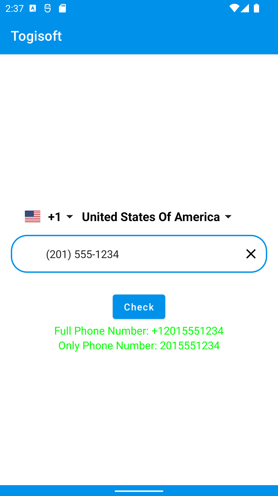
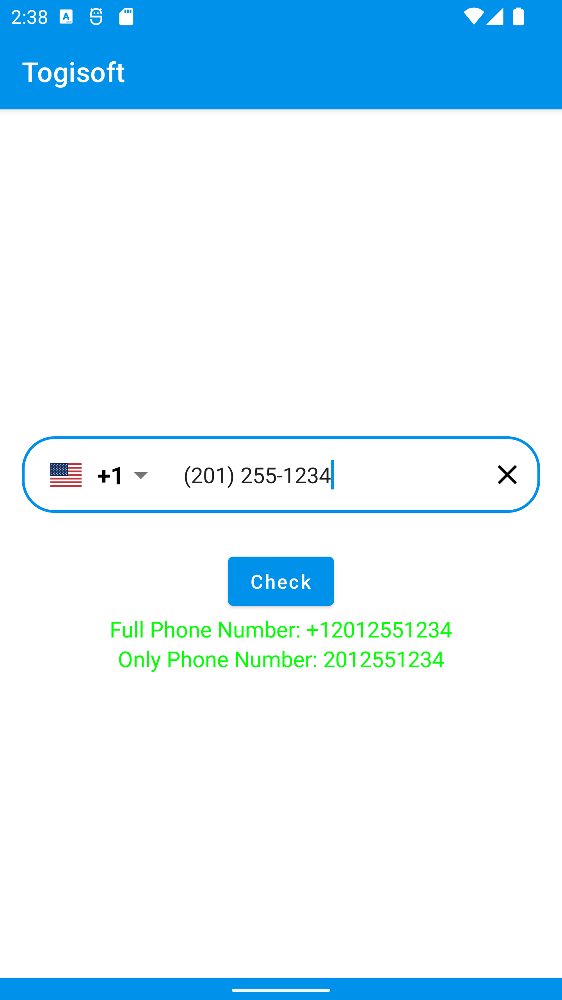
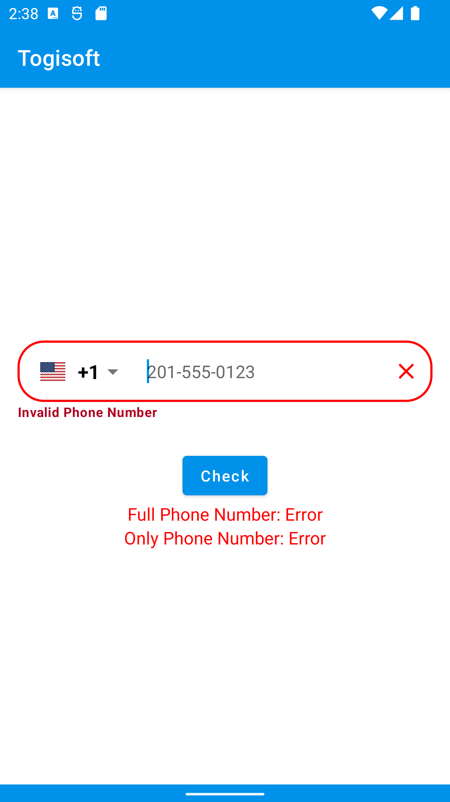
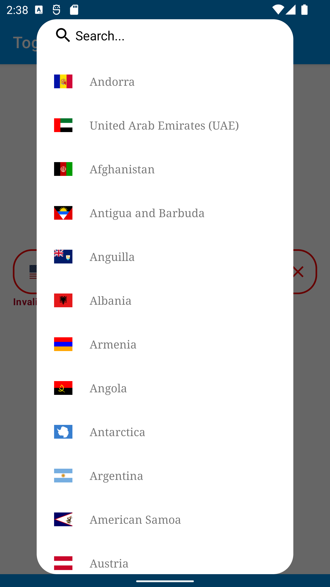
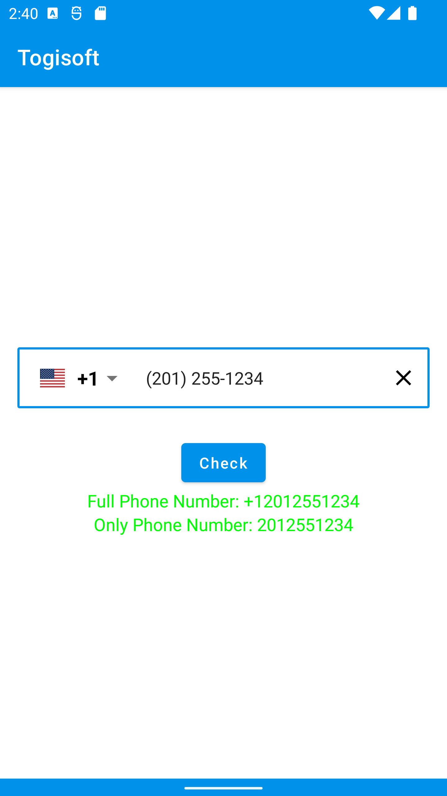
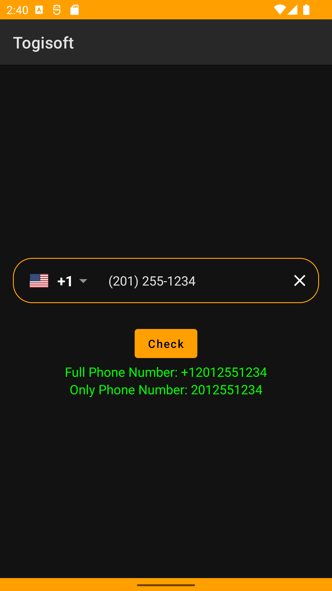
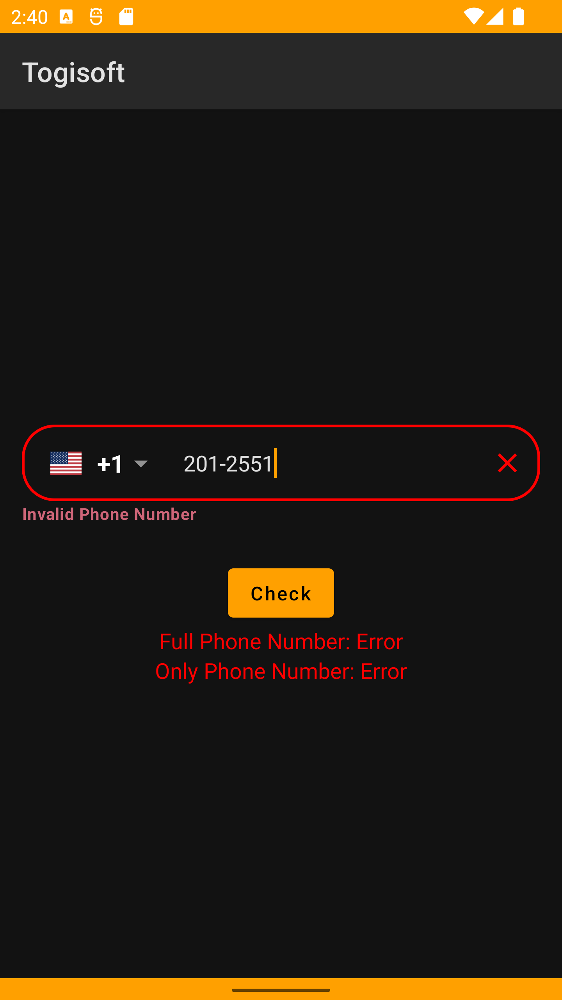
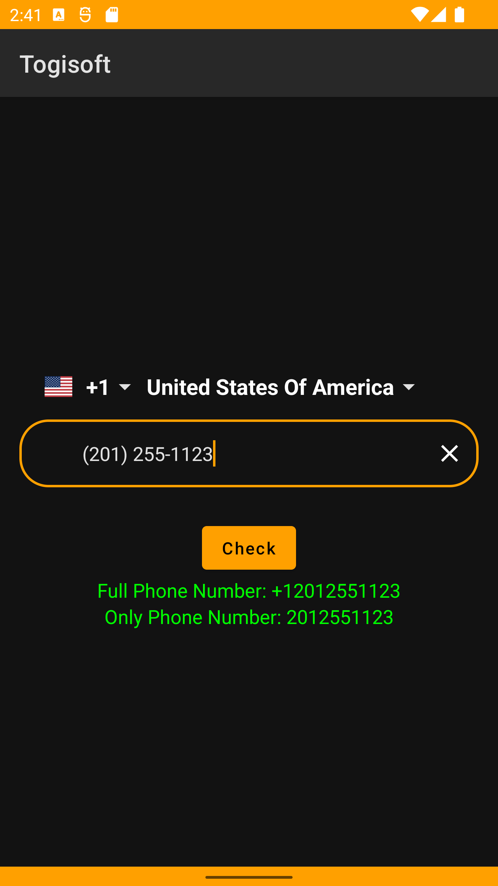

# Jetpack Compose Country Code Picker

Jetpack Compose Country Code Picker

<a href="https://www.buymeacoffee.com/togitech" target="_blank"></a>

<h1>Updated</h1>

If you are looking for Country Phone Code Picker for Jetpack Compose you can use the package.

* Country numbers hints
* Phone number visualTransformation (Automatic number formatting)
* Automatic country recognition (detection by sim card if sim card is inserted)
* With TextField
* Can Customize
* Added language translations
* Added clear text button
* Dialog changed

Languages:

* Turkish
* English
* Italian
* Arabic
* Russian
* Dutch
* Hindi

For language support, you can translate the file below and send it to me.
https://github.com/togisoft/jetpack_compose_country_code_picker/blob/master/ccp/src/main/res/values/strings.xml

<h3>Screenshots</h3>
<div class="row">
   
   
   
   
   
   
   
   
 </div>


<h3> USAGE </h3>

```kotlin
@Composable
fun TogiCountryCodePicker(
    modifier: Modifier = Modifier,
    text: String,
    onValueChange: (String) -> Unit,
    shape: Shape = RoundedCornerShape(24.dp),
    color: Color = MaterialTheme.colors.background,
    showCountryCode: Boolean = true,
    showCountryFlag: Boolean = true,
    focusedBorderColor: Color = MaterialTheme.colors.primary,
    unfocusedBorderColor: Color = MaterialTheme.colors.onSecondary,
    cursorColor: Color = MaterialTheme.colors.primary,
    bottomStyle: Boolean = false
)

```  

<h3> EXAMPLE </h3>


```kotlin
@Composable
fun CountryCodePickerExample() {
    Column(
        modifier = Modifier
            .verticalScroll(rememberScrollState())
            .fillMaxSize(),
        verticalArrangement = Arrangement.Center,
        horizontalAlignment = Alignment.CenterHorizontally
    ) {

        val phoneNumber = rememberSaveable { mutableStateOf("") }
        val fullPhoneNumber = rememberSaveable { mutableStateOf("") }
        val onlyPhoneNumber = rememberSaveable { mutableStateOf("") }

        TogiCountryCodePicker(
            text = phoneNumber.value,
            onValueChange = { phoneNumber.value = it },
            unfocusedBorderColor = MaterialTheme.colors.primary,
            bottomStyle =false, //  if true the text-field is below the country code selector at the top.
            shape = RoundedCornerShape(24.dp)
        )
        Spacer(modifier = Modifier.height(10.dp))
        Button(onClick = {
            if (!isPhoneNumber()) {
                fullPhoneNumber.value = getFullPhoneNumber()
                onlyPhoneNumber.value = getOnlyPhoneNumber()
            } else {
                fullPhoneNumber.value = "Error"
                onlyPhoneNumber.value = "Error"
            }
        }) {
            Text(text = "Check")
        }

        Text(
            text = "Full Phone Number: ${fullPhoneNumber.value}",
            color = if (getErrorStatus()) Color.Red else Color.Green
        )

        Text(
            text = "Only Phone Number: ${onlyPhoneNumber.value}",
            color = if (getErrorStatus()) Color.Red else Color.Green
        )
    }
}

```

<h3><- Functions -></h3>

<b>getFullPhoneNumber()</b>  => Phone number with country code => return type <b>String</b> </br>
<b>getOnlyPhoneNumber()</b> => Phone number only => return type <b>String</b> </br>
<b>isPhoneNumber()</b> => Checks if the phone number is correct based on the country code => return type <b>Boolean</b>/</br>

<h3> How to add in your project </h3>

In the build.gradle add maven central repository

```groovy
    repositories {
    maven { url 'https://jitpack.io' }
}

```

Step 2. Add the dependency

```
  dependencies {
	    implementation 'com.github.togisoft:jetpack_compose_country_code_picker:1.1.4'
	}  
```    


