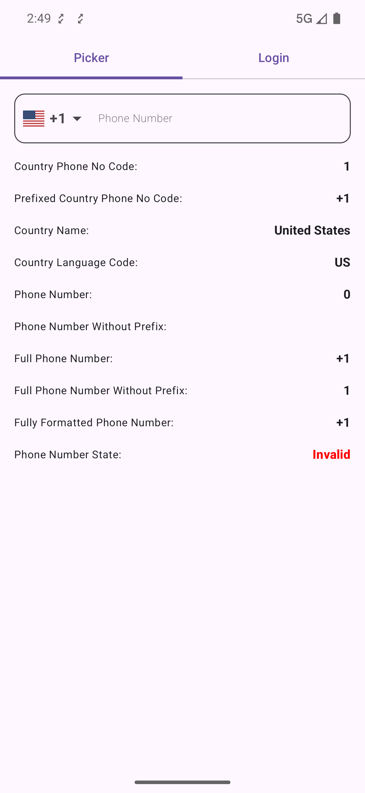
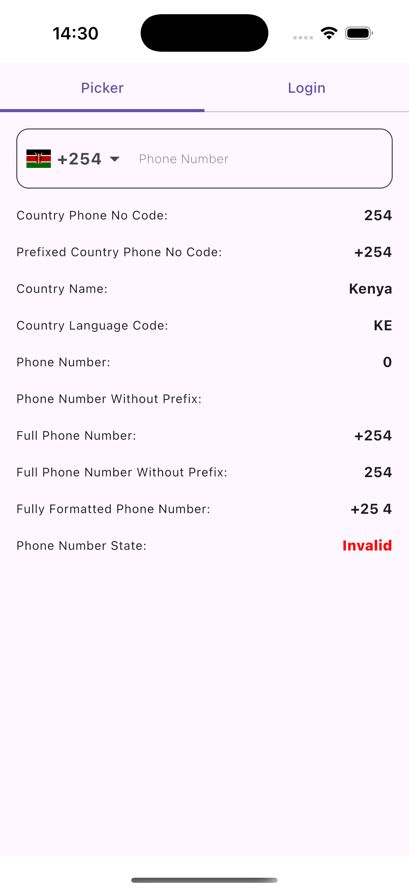
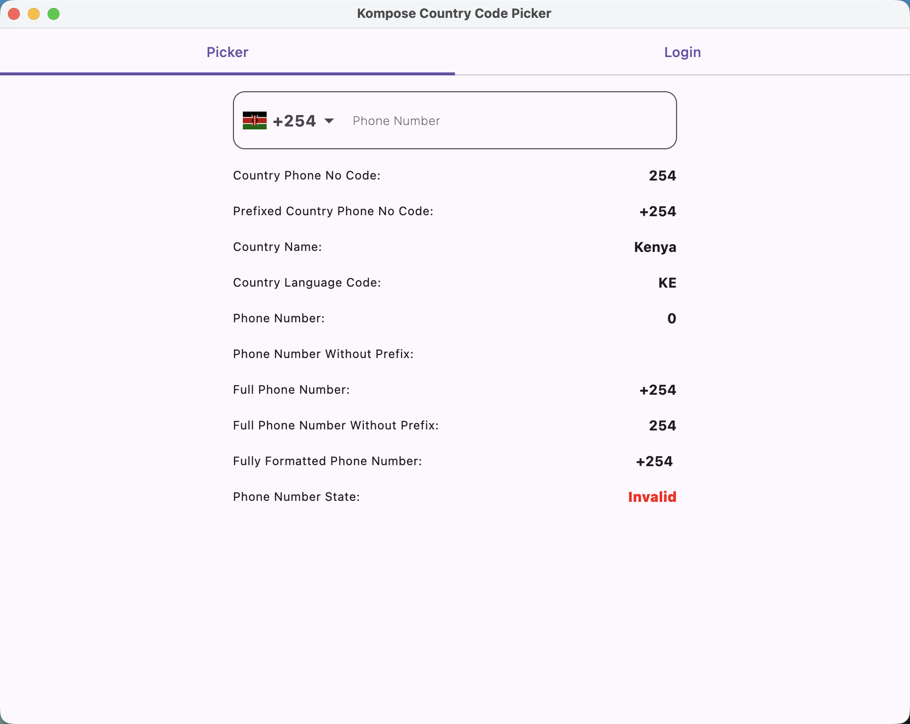
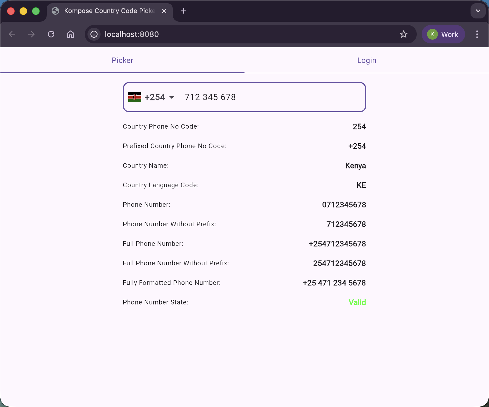
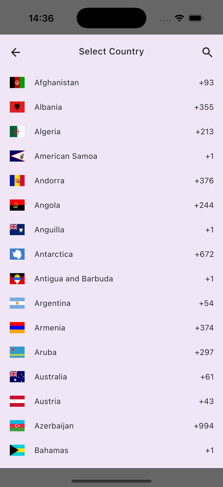
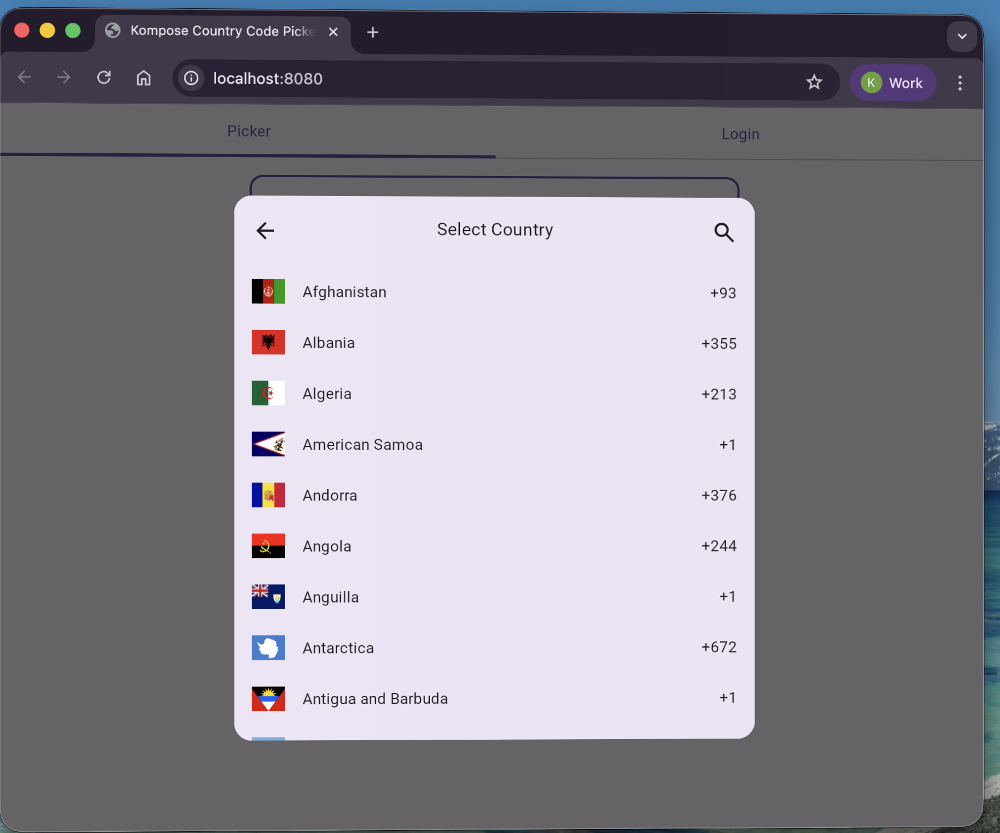

[](https://search.maven.org/artifact/io.github.joelkanyi/komposecountrycodepicker)


[](https://opensource.org/licenses/Apache-2.0)

# Kompose Country Code Picker

A Compose Multiplatform country code picker built with Material 3.

**Supported platforms:** Android · iOS · Desktop (JVM) · Web (JS) · Web (WasmJS)

See the [project's website](https://joelkanyi.github.io/kompose-country-code-picker/) for full documentation.

## Preview

| Android | iOS | Desktop | Web |
|:-------:|:---:|:-------:|:---:|
|  |  |  |  |
|  |  |  |  |

## Features

- 250+ countries with flags, dialling codes, and localized names
- Built-in phone number validation and formatting
- Search with accent-normalized matching
- Responsive dialog — full-screen on mobile, popup on desktop/web
- 13 language translations
- Customizable colors, shapes, and icons
- Keyboard navigation support (Arrow keys, Enter, Escape) on desktop and web

## Quick Start

Add the dependency to your `commonMain` source set:

```kotlin
kotlin {
    sourceSets {
        commonMain.dependencies {
            implementation("io.github.joelkanyi:komposecountrycodepicker:<latest-version>")
        }
    }
}
```

Use the picker in your Composable:

```kotlin
var phoneNumber by rememberSaveable { mutableStateOf("") }
val state = rememberKomposeCountryCodePickerState(
    showCountryCode = true,
    showCountryFlag = true,
)

KomposeCountryCodePicker(
    modifier = Modifier.fillMaxWidth(),
    text = phoneNumber,
    onValueChange = { phoneNumber = it },
    state = state,
)
```

## Translations

This project includes translations for the following languages:

- Arabic (ar)
- German (de)
- Spanish (es)
- French (fr)
- Hindi (hi)
- Indonesian (in-rID)
- Italian (it-IT)
- Japanese (ja)
- Dutch (nl)
- Russian (ru-RU)
- Swahili (sw)
- Turkish (tr-TR)
- Vietnamese (vi)

If your language is not included, or if you notice any errors in the current translations, please [open an issue](https://github.com/joelkanyi/kompose-country-code-picker/issues) on GitHub.

## License

```
Copyright 2025 Joel Kanyi

Licensed under the Apache License, Version 2.0 (the "License");
you may not use this file except in compliance with the License.
You may obtain a copy of the License at

   http://www.apache.org/licenses/LICENSE-2.0

Unless required by applicable law or agreed to in writing, software
distributed under the License is distributed on an "AS IS" BASIS,
WITHOUT WARRANTIES OR CONDITIONS OF ANY KIND, either express or implied.
See the License for the specific language governing permissions and
limitations under the License.
```
