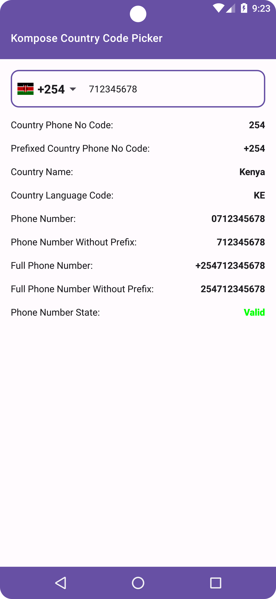
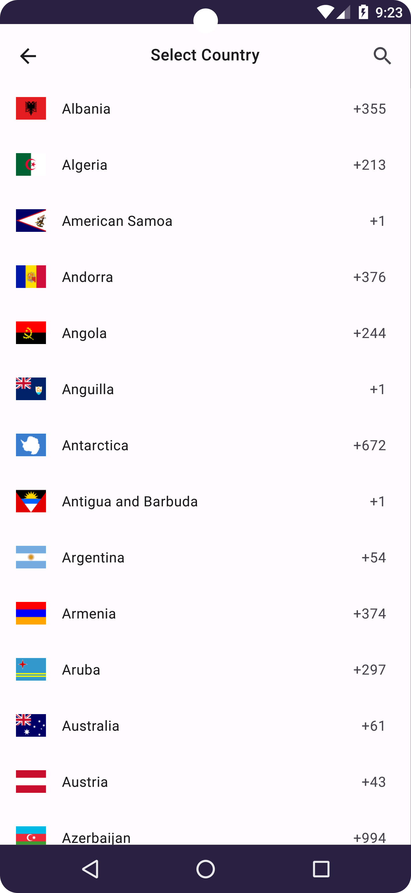
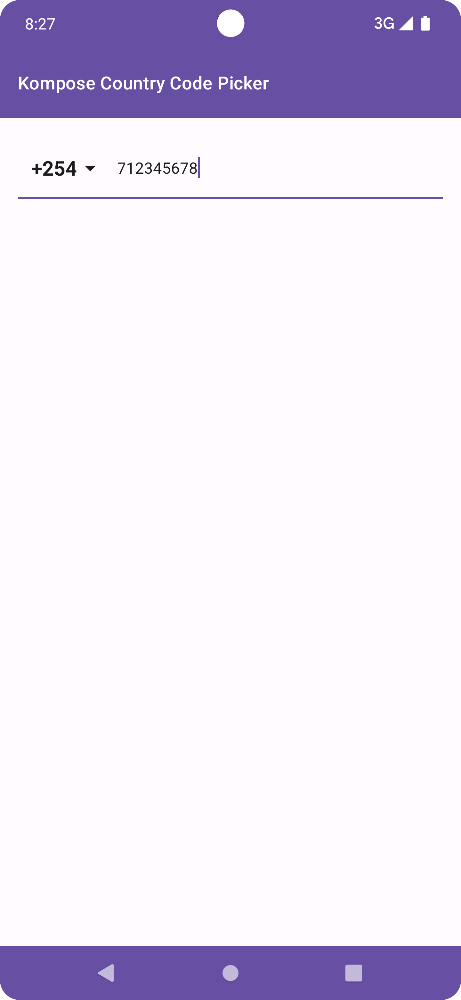

# Kompose Country Code Picker

[](https://www.android.com)
[](https://android-arsenal.com/api?level=21)
[](https://www.apache.org/licenses/LICENSE-2.0.html)
[](https://jitpack.io/#JoelKanyi/KomposeCountryCodePicker)

Kompose Country Code Picker is a Jetpack Compose library based on Material 3 (M3) that provides a
country code picker for Android apps.

## Preview

 Picker                                                           | Dialog                                                        | Picker Only                                                 
------------------------------------------------------------------|---------------------------------------------------------------|-------------------------------------------------------------
  |  |  

## Requirements

Jetpack compose material three
dependency - `implementation("androidx.compose.material3:material3:1.1.1")`

### Setup

#### Add this in your root `build.gradle` file (**not** your module `build.gradle` file):

```groovy
allprojects {
    repositories {
        maven { url "https://jitpack.io" }
    }
}
```

### Dependency

Add the following to your `build.gradle` dependencies:

```groovy
dependencies {
    implementation("com.github.JoelKanyi:KomposeCountryCodePicker:<version>")
}
```

## KomposeCountryCodePicker State

`val state = rememberKomposeCountryCodePickerState()`

The `state` parameter is used to set and access different variables/methods that are available in the `KomposeCountryCodePicker` composable.

```kotlin
val state = rememberKomposeCountryCodePickerState(
    limitedCountries = listOf("KE", "UG", "TZ", "RW", "SS"),
    showCountryCode = true,
    showCountryFlag = true,
    defaultCountryCode = "TZ",
)
```

- `showCountryCode` - If `true`, the country code will be displayed in the country code picker `TextField`
- `showCountryFlag` - If `true`, the country flag will be displayed in the country code picker `TextField`
- `defaultCountryCode` - Sets the default country code to be displayed in the country code picker
- `limitedCountries` - Limits the list of countries to be displayed in the country code picker by
  specify the country codes, country names or country phone codes
  i.e `listOf("KE", "UG", "TZ")`, `listOf("Kenya", "Uganda", "Tanzania")`
  or `listOf("+254", "+256", "+255")`


## Usage

```kotlin
val phoneNumber = rememberSaveable { mutableStateOf("") }
val state = rememberKomposeCountryCodePickerState()

KomposeCountryCodePicker(
    modifier = Modifier
        .fillMaxWidth(),
    text = phoneNumber.value,
    onValueChange = { phoneNumber.value = it },
    placeholder = { Text(text = "Phone Number") },
    shape = MaterialTheme.shapes.medium,
    colors = TextFieldDefaults.colors(
        unfocusedContainerColor = Color.Transparent,
        focusedContainerColor = Color.Transparent,
    ),
    state = state,
)
```

## KomposeCountryCodePicker Composable without TextField

With the `showOnlyCountryCodePicker` parameter set to `true`, the `KomposeCountryCodePicker`
composable can be used without the `TextField`.

```kotlin
val state = rememberKomposeCountryCodePickerState()

KomposeCountryCodePicker(
    modifier = Modifier,
    showOnlyCountryCodePicker = true,
    text = phoneNumber.value,
    state = state,
)
```

## Integration with TextField

```kotlin
val phoneNumber = rememberSaveable { mutableStateOf("") }
val state = rememberKomposeCountryCodePickerState()

TextField(
    modifier = Modifier
        .fillMaxWidth(),
    value = phoneNumber.value,
    onValueChange = { phoneNumber.value = it },
    placeholder = { Text(text = "Phone Number") },
    leadingIcon = {
        KomposeCountryCodePicker(
            modifier = Modifier,
            showOnlyCountryCodePicker = true,
            text = phoneNumber.value,
            state = state,
        )
    },
    colors = TextFieldDefaults.colors(
        unfocusedContainerColor = Color.Transparent,
        focusedContainerColor = Color.Transparent,
    ),
)
```

## KomposeCountryCodePicker Textfield Composable customizations

 Customization                          | Description                                                         
----------------------------------------|---------------------------------------------------------------------                      
 `placeholder`                          | Sets the placeholder `Composable` for the country code picker       
 `shape`                                | Sets the shape of the country code picker `TextField`               
 `error`                                | Sets the error state on the `TextField` for the country code picker 
 `colors`                               | Sets the colors for the country code picker `TextField`             
 `showOnlyCountryCodePicker`            | Shows only the country code picker without the `TextField`          
 `state`                                | The state of the country code picker                                
 `countrySelectionDialogContainerColor` | The color of the country selection dialog container                 
 `countrySelectionDialogContentColor`   | The color of the country selection dialog content                   

## Available methods/variables

Use the state that you defined (`val state = rememberKomposeCountryCodePickerState()`) to access the
following methods/variables:

 Description                      | Method                                     
----------------------------------|--------------------------------------------
 `countryCode`                    | Returns the country code for the selected country                   
 `phoneNumber`                    | Returns the phone number entered by the user  
 Country Phone No Code            | `state.getCountryPhoneCodeWithoutPrefix()` 
 Country Name                     | `state.getCountryName()`                   
 Country Language Code            | `state.getCountryCodeWithoutPrefix()`      
 Phone Number Without Prefix      | `state.getPhoneNumberWithoutPrefix()`      
 Full Phone Number                | `state.getFullPhoneNumber()`               
 Full Phone Number Without Prefix | `state.getFullPhoneNumberWithoutPrefix()`  
 Phone Number State               | `state.isPhoneNumberValid()`               

## Contributing

Any contributions, large or small, major features, bug fixes, are welcomed and appreciated
but will be thoroughly reviewed.

## License

```
Copyright 2023 Joel Kanyi

Licensed under the Apache License, Version 2.0 (the "License");
you may not use this file except in compliance with the License.
You may obtain a copy of the License at

 http://www.apache.org/licenses/LICENSE-2.0

Unless required by applicable law or agreed to in writing, software
distributed under the License is distributed on an "AS IS" BASIS,
WITHOUT WARRANTIES OR CONDITIONS OF ANY KIND, either express or implied.
See the License for the specific language governing permissions and
limitations under the License.
