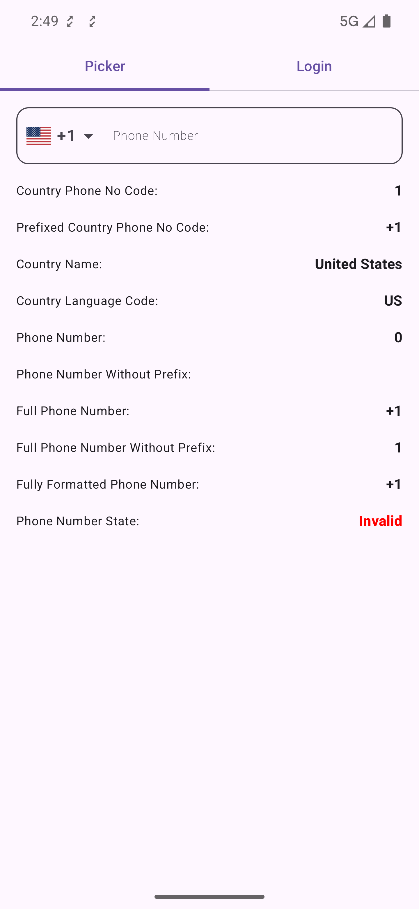
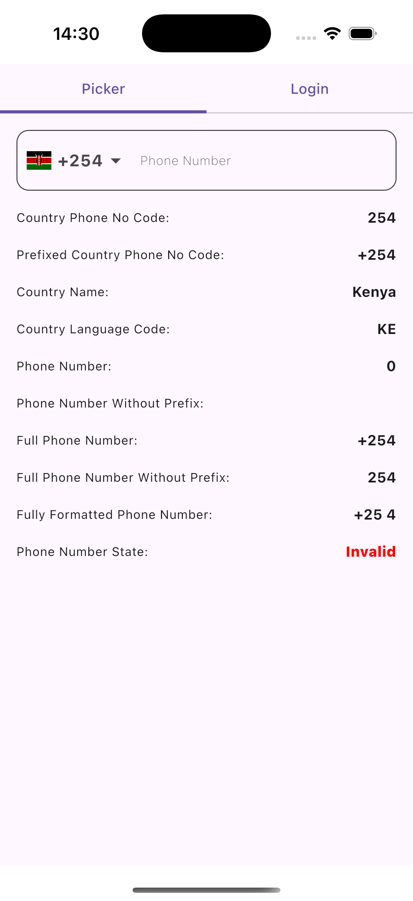
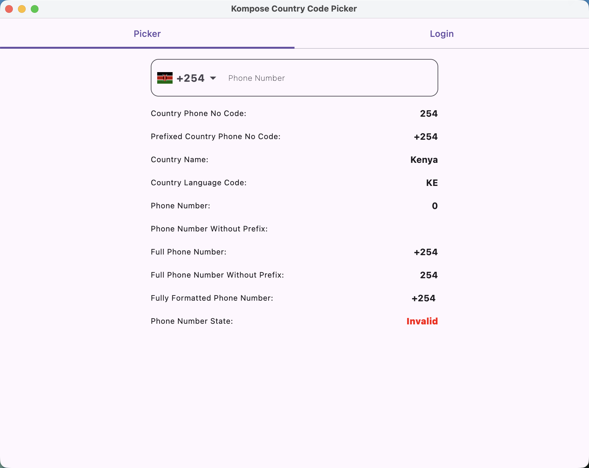
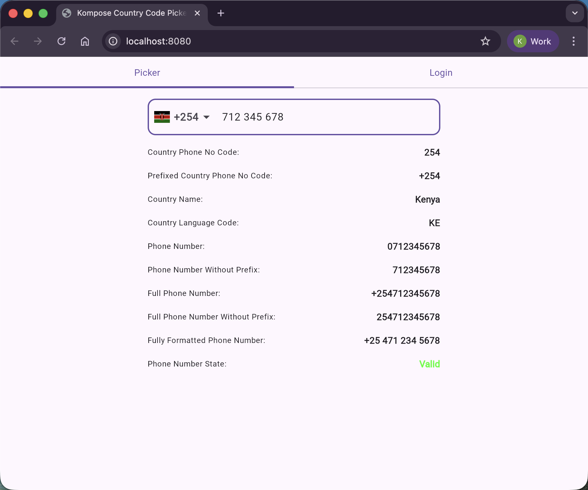
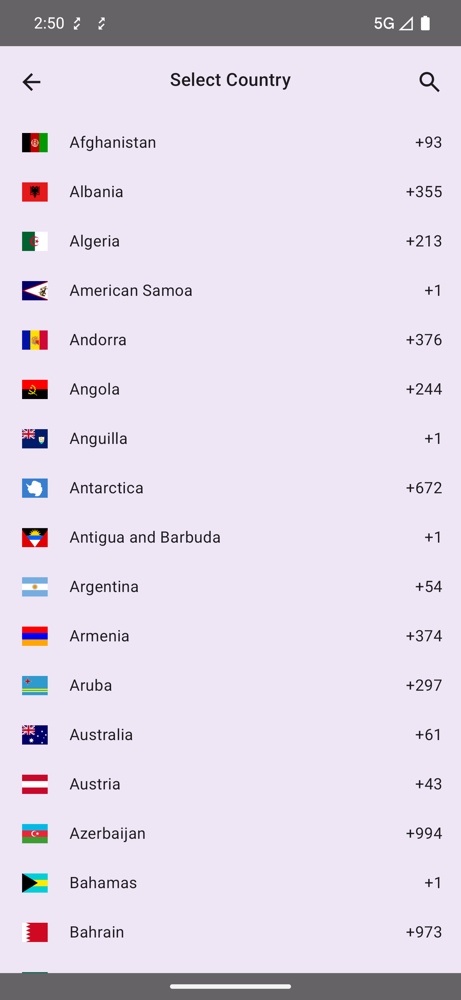
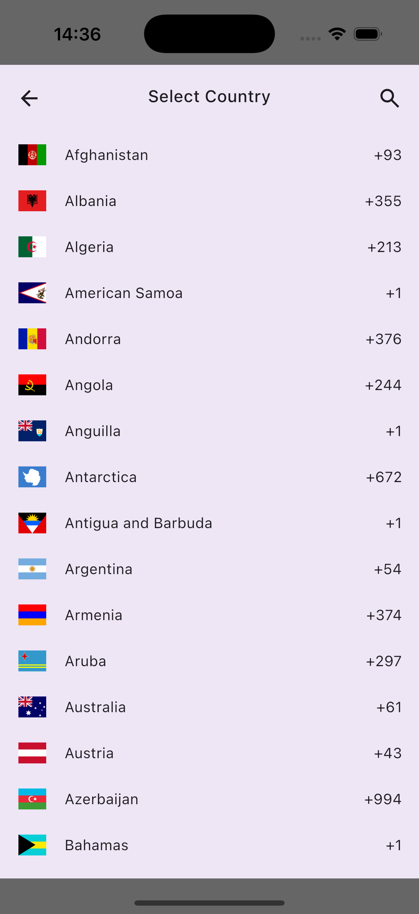
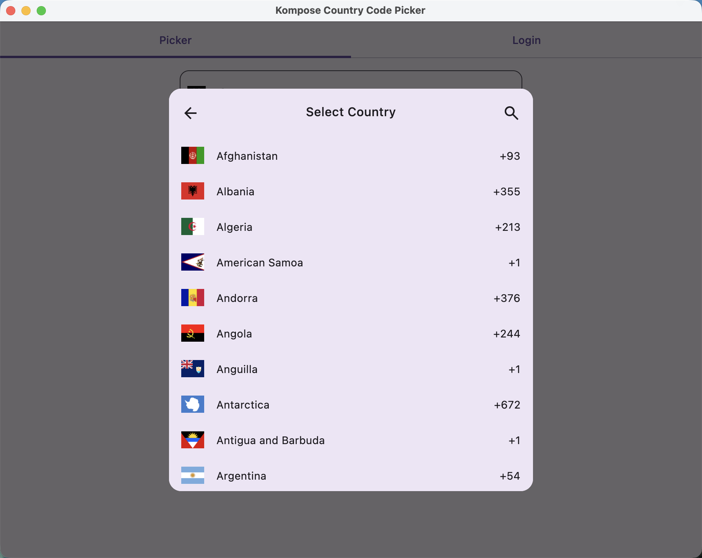
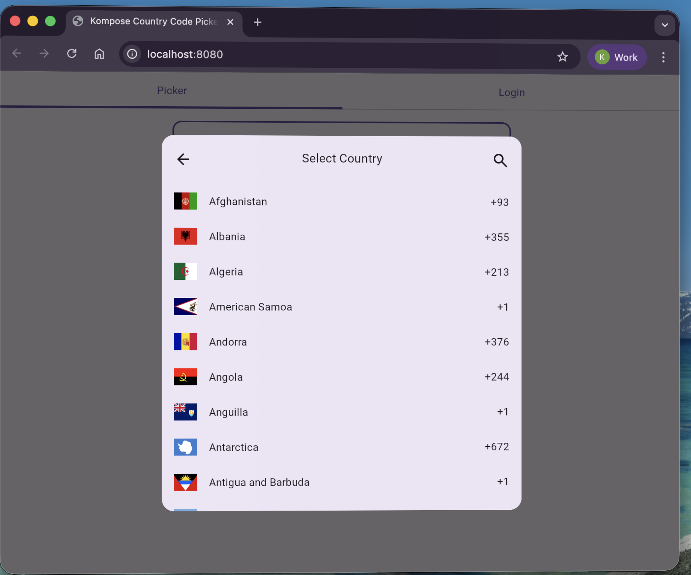

[](https://search.maven.org/artifact/io.github.joelkanyi/komposecountrycodepicker)


[](https://opensource.org/licenses/Apache-2.0)

# Kompose Country Code Picker

A Compose Multiplatform country code picker built with Material 3.

**Supported platforms:** Android · iOS · Desktop (JVM) · Web (JS) · Web (WasmJS)

See the [project's website](https://joelkanyi.github.io/kompose-country-code-picker/) for full documentation.

## Features

- 250+ countries with flags, dialling codes, and localized names
- Built-in phone number validation and formatting
- Search with accent-normalized matching
- Responsive dialog - full-screen on mobile, popup on desktop/web
- Custom text field support - use `CountrySelectionDialog` + `state.selectedCountry` for fully custom layouts
- 13 language translations
- Customizable colors, shapes, and icons
- Keyboard navigation support (Arrow keys, Enter, Escape) on desktop and web

## Installation

Add the Maven Central repository if it is not already there:

```kotlin
repositories {
    mavenCentral()
}
```

### Multiplatform Projects

Add the dependency to your `commonMain` source set:

```kotlin
kotlin {
    sourceSets {
        commonMain {
            dependencies {
                implementation("io.github.joelkanyi:komposecountrycodepicker:<latest-version>")
            }
        }
    }
}
```

### Android Projects

Add the dependency to your app's `build.gradle.kts`:

```kotlin
dependencies {
    implementation("io.github.joelkanyi:komposecountrycodepicker:<latest-version>")
}
```

### Gradle Version Catalog

Add the following to your `libs.versions.toml`:

```toml
[versions]
komposecountrycodepicker = "<latest-version>"

[libraries]
komposecountrycodepicker = { module = "io.github.joelkanyi:komposecountrycodepicker", version.ref = "komposecountrycodepicker" }
```

Then add the dependency in your `build.gradle.kts`:

```kotlin
dependencies {
    implementation(libs.komposecountrycodepicker)
}
```

## Quick Start

Use the picker in your Composable:

```kotlin
var phoneNumber by rememberSaveable { mutableStateOf("") }
val state = rememberKomposeCountryCodePickerState(
    showCountryCode = true,
    showCountryFlag = true,
)

KomposeCountryCodePicker(
    modifier = Modifier.fillMaxWidth(),
    text = phoneNumber,
    onValueChange = { phoneNumber = it },
    state = state,
)
```

### Fully Custom Text Field

If you have your own design system and want to use your own text field, use `CountrySelectionDialog` and `state.selectedCountry` directly:

```kotlin
@OptIn(RestrictedApi::class)
@Composable
fun PhoneNumberField() {
    var phoneNumber by rememberSaveable { mutableStateOf("") }
    var showCountryPicker by rememberSaveable { mutableStateOf(false) }
    val state = rememberKomposeCountryCodePickerState()

    if (showCountryPicker) {
        CountrySelectionDialog(
            countryList = state.countryList,
            containerColor = MaterialTheme.colorScheme.background,
            contentColor = MaterialTheme.colorScheme.onBackground,
            onDismissRequest = { showCountryPicker = false },
            onSelect = { country ->
                state.setCode(country.code)
                showCountryPicker = false
            },
        )
    }

    OutlinedTextField(
        modifier = Modifier.fillMaxWidth(),
        value = phoneNumber,
        onValueChange = { phoneNumber = it },
        placeholder = { Text("Phone Number") },
        keyboardOptions = KeyboardOptions(keyboardType = KeyboardType.Phone),
        leadingIcon = {
            Row(
                modifier = Modifier
                    .clickable { showCountryPicker = true }
                    .padding(start = 12.dp, end = 8.dp),
                verticalAlignment = Alignment.CenterVertically,
            ) {
                Image(
                    modifier = Modifier.width(28.dp).height(18.dp),
                    painter = painterResource(state.selectedCountry.flag),
                    contentDescription = state.selectedCountry.name,
                )
                Spacer(modifier = Modifier.width(6.dp))
                Text(text = state.selectedCountry.phoneNoCode)
            }
        },
    )
}
```

See the [full documentation](https://joelkanyi.github.io/kompose-country-code-picker/usage/#fully-custom-phone-input) for more details and a `BasicTextField` variant.

## Preview

| Android | iOS | Desktop | Web |
|:-------:|:---:|:-------:|:---:|
|  |  |  |  |
|  |  |  |  |

## Translations

This project includes translations for the following languages:

- Arabic (ar)
- German (de)
- Spanish (es)
- French (fr)
- Hindi (hi)
- Indonesian (in-rID)
- Italian (it-IT)
- Japanese (ja)
- Marathi (mr)
- Dutch (nl)
- Russian (ru-RU)
- Swahili (sw)
- Tamil (ta)
- Turkish (tr-TR)
- Vietnamese (vi)

If your language is not included, or if you notice any errors in the current translations, please [open an issue](https://github.com/joelkanyi/kompose-country-code-picker/issues) on GitHub.

## License

```
Copyright 2025 Joel Kanyi

Licensed under the Apache License, Version 2.0 (the "License");
you may not use this file except in compliance with the License.
You may obtain a copy of the License at

   http://www.apache.org/licenses/LICENSE-2.0

Unless required by applicable law or agreed to in writing, software
distributed under the License is distributed on an "AS IS" BASIS,
WITHOUT WARRANTIES OR CONDITIONS OF ANY KIND, either express or implied.
See the License for the specific language governing permissions and
limitations under the License.
```
