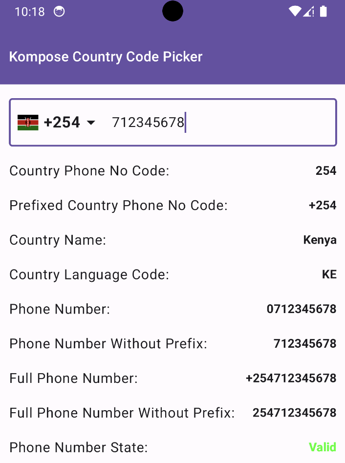
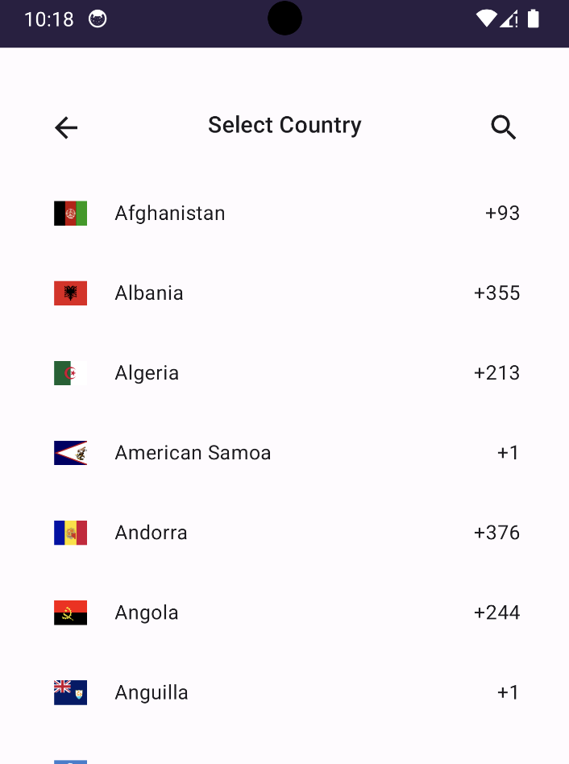
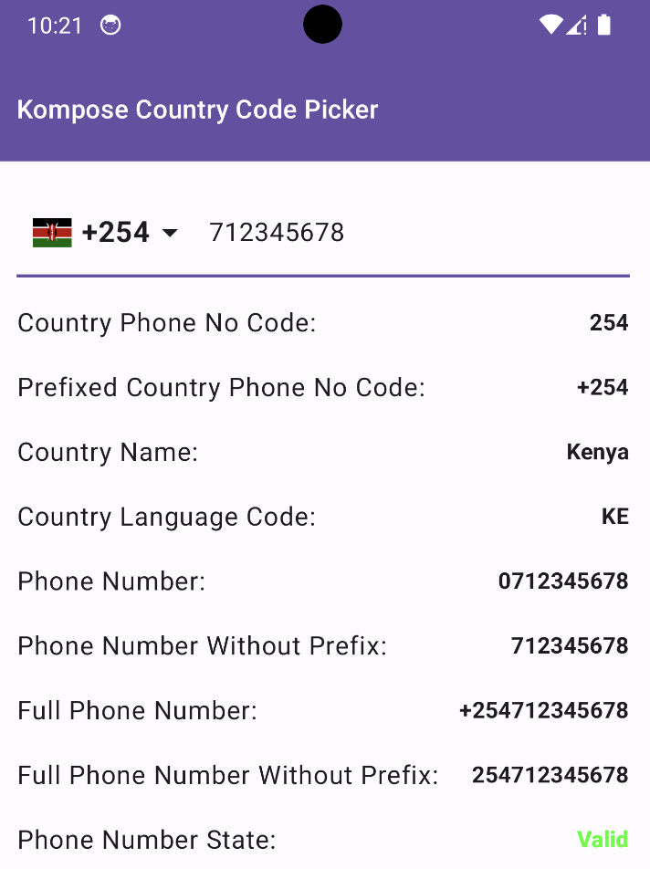

Kompose Country Code Picker is a Jetpack Compose library based on Material 3 (M3) that provides a
country code picker for Android apps.

## Preview

 Picker                                                           | Dialog                                                        | Picker Only                                                 
------------------------------------------------------------------|---------------------------------------------------------------|-------------------------------------------------------------
 {: style="height:350px;width:250px"} |  {: style="height:350px;width:250px"} |  {: style="height:350px;width:250px"}


### Including it in your project:

#### Add the Maven Central repository if it is not already there:
```gradle
repositories {
    mavenCentral()
}
```

#### Add the dependency to your dependencies block in your app's build.gradle file:
```kotlin
dependencies {
    implementation("io.github.joelkanyi:komposecountrycodepicker:<latest-version>")
}
```

#### For those using Gradle Version Catalog, you can add the dependency as follows:
```libs.version.toml
[versions]
komposecountrycodepicker = "<latest-version>"

[libraries]
komposecountrycodepicker = { module = "io.github.joelkanyi:komposecountrycodepicker", version.ref = "komposecountrycodepicker" }
```

## License

```
Copyright 2023 Joel Kanyi

Licensed under the Apache License, Version 2.0 (the "License");
you may not use this file except in compliance with the License.
You may obtain a copy of the License at

 http://www.apache.org/licenses/LICENSE-2.0

Unless required by applicable law or agreed to in writing, software
distributed under the License is distributed on an "AS IS" BASIS,
WITHOUT WARRANTIES OR CONDITIONS OF ANY KIND, either express or implied.
See the License for the specific language governing permissions and
limitations under the License.
```
